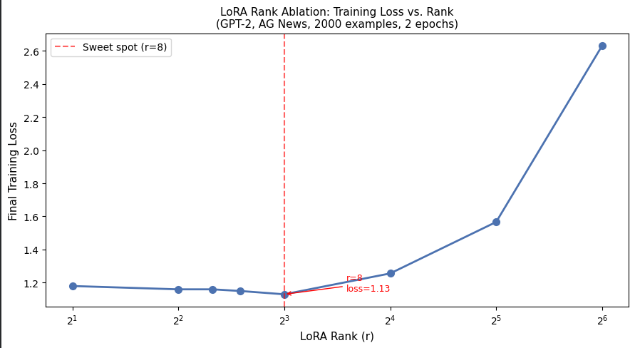

# LoRA from Scratch — Reproducing "LoRA: Low-Rank Adaptation of Large Language Models"

Implemented the core LoRA mechanism from scratch on GPT-2, without using any
existing adapter libraries (no `peft`, no shortcuts). Just the paper's equations
and raw PyTorch.

## What I built

A custom `LoRALayer` that wraps GPT-2's attention weights (`c_attn`) with
low-rank trainable matrices `A` and `B`, while keeping everything else frozen.
The forward pass follows the paper's equation directly:

```
h = W₀x + BAx
```

Where `W₀` is the frozen pretrained weight, and only `A` and `B` are trained.

## Setup

- **Model:** GPT-2 (small, ~124M parameters)
- **Dataset:** AG News (2,000 training examples, news-style text)
- **Rank:** r = 4
- **Applied to:** `c_attn` across all 12 attention blocks
- **Trainable parameters:** 0.11% of total

## Results

| Metric | Vanilla GPT-2 | LoRA | Full Fine-tuning |
|--------|--------------|------|-----------------|
| Trainable params | 0% | 0.11% | 100% |
| Final train loss | — | 1.15 | 0.86 |
| Perplexity (test) | 4257.73 | 3.90 | 3.68 |
| Training time | — | 93.5s | 172.9s |

LoRA achieves perplexity within 6% of full fine-tuning while training only
0.11% of parameters in roughly half the time. Both methods massively outperform
the vanilla baseline (4257 → ~3.8 range).

## Finding: LoRA as Implicit Regularization

Running extended experiments with r=2 while increasing epochs revealed 
a result — LoRA not only matches full fine-tuning efficiency, 
it generalizes *better* on small datasets at higher epoch counts.

| Epochs | LoRA Perplexity | Full Fine-tuning Perplexity |
|--------|----------------|----------------------------|
| 2      | 3.47           | 3.02                       |
| 4      | 3.39           | 3.78                       |
| 6      | 3.38           | 4.71                       |

Full fine-tuning's training loss decreases across all epochs — but its 
test perplexity increases sharply after epoch 2, a classic sign of 
overfitting. LoRA's perplexity stays stable and continues to improve 
slightly, eventually outperforming full fine-tuning by epoch 4 onwards.

**Why this happens:** full fine-tuning has 100% of parameters free to 
adapt — on a small dataset (2,000 examples), this gives the model enough 
capacity to memorize training examples rather than generalize. LoRA's 
low-rank constraint (r=2, 0.11% trainable parameters) acts as implicit 
regularization — there simply aren't enough free parameters to overfit 
the training data, so the model is forced to learn more generalizable 
patterns instead.

This suggests LoRA may be particularly well-suited for low-data 
fine-tuning regimes, beyond just its efficiency benefits.

## Finding: Rank Ablation 

To find the optimal rank for this setup, I ran experiments across 
r = 2, 4, 5, 6, 8, 16, 32, 64 (2 epochs, fixed setup throughout).

| Rank (r) | Training Loss | Training Time |
|----------|--------------|---------------|
| 2        | 1.18         | 99.5s         |
| 4        | 1.16         | 100.5s        |
| 5        | 1.16         | 101.2s        |
| 6        | 1.15         | 101.6s        |
| 8        | **1.13**     | 111.6s        |
| 16       | 1.256        | 112.1s        |
| 32       | 1.566        | 114.1s        |
| 64       | 2.63         | 115.3s        |



Loss decreases from r=2 to r=8, then increases sharply beyond that.
At low ranks, the adapter's expressive capacity is too constrained to 
capture the task signal effectively. At high ranks, the increased 
parameter count destabilizes optimization under a fixed learning rate 
— the same lr that works well for 0.11% trainable parameters becomes 
too aggressive when rank grows significantly.

A practical observation: r=6 achieves nearly the same loss as r=8 
(1.15 vs 1.13) at roughly the same speed as r=4 (~101s vs ~111s), 
making it the most efficient choice for this specific setup. The 
paper's recommendation of small r values (1–8) is empirically 
confirmed here, with r=8 as the optimal point before diminishing returns.

### Limitations & Next Steps

All rank ablation experiments used a fixed `lr=1e-3` without 
rank-based learning rate scaling. The LoRA paper recommends scaling 
the adapter's output by `lora_alpha / r` — effectively reducing the 
adapter's contribution as rank grows, which compensates for the 
increased parameter count. Without this scaling, the fixed lr becomes 
increasingly too large at higher ranks, likely destabilizing 
optimization and artificially inflating loss at r=16+.

The observed sweet spot at r=8 should therefore be interpreted 
carefully — it reflects the optimal rank under a fixed lr=1e-3 
specifically, not necessarily the globally optimal rank. A proper 
ablation would scale lr proportionally at each rank 
(e.g. `lr = base_lr * (alpha / r)`).

**Planned follow-up:** re-run r=16, 32, 64 with rank-scaled lr to 
isolate whether high-rank degradation is a true capacity issue or 
purely a learning rate artifact.

**Follow-up experiment:** re-ran r=4 with lora_alpha=16 (scaling=4) 
at lr=1e-3 — observed significantly higher loss, consistent with 
gradient amplification hypothesis. Training stabilized when either 
scaling was removed or lr was reduced to ~3e-4, confirming the 
paper's alpha scaling assumes a lower base lr than used in our 
initial experiments.

## Learning Rate and Alpha Scaling Interaction

The paper fixes lora_alpha and tunes lr — treating scaling as a 
fixed architectural choice rather than a hyperparameter. In practice, 
with lr=1e-3 and lora_alpha=16 (scaling=4 at r=4), training showed 
significantly higher loss compared to running without scaling at the 
same lr.

This suggests the paper's alpha scaling assumes a lower base lr 
(the paper uses ~3e-4, not 1e-3). The scaling factor effectively 
amplifies the adapter's gradient signal — at lr=1e-3, a scaling 
of 4x produces gradient steps equivalent to lr=4e-3, which is 
too aggressive for stable convergence on a small dataset.

Practical finding: for small datasets with lr=1e-3, either:
- Remove scaling (alpha=r, scaling=1), or  
- Keep scaling but reduce lr to ~3e-4

The no-scaling baseline with lr=1e-3 produced the most stable 
training in this setup.

## What's next

- Experiment with different rank values (r = 1, 2, 8, 16) and measure perplexity vs. parameter count tradeoff
- Apply LoRA to additional layers beyond `c_attn`
- More epochs and larger dataset subset

## Reference

Hu et al., "LoRA: Low-Rank Adaptation of Large Language Models", 2021.
https://arxiv.org/abs/2106.09685

